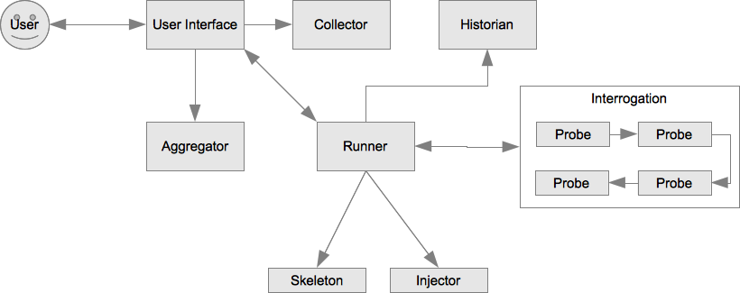

============================
crushinator: Design Document
============================

:Author: Josh Johnson <lionface.lemonface@gmail.com>
:Licence: `Creative Commons Attribution-ShareAlike 3.0 Unported License <http://creativecommons.org/licenses/by-sa/3.0/>`_

.. contents::

Background
==========

Origins/Backstory
-----------------
The idea for crushinator has its seeds in the ZopeSkel sprint at the 2008 Plone
conference in Washington, D.C. 

ZopeSkel grew out of the `PythonPaste`_ project. PythonPaste
is a suite of utilities that allow python developers to build and deploy applications
in a RAD style. ZopeSkel uses the PasteScript component to generate Zope and Plone boilerplate
code in an interactive, additive way.

As far as I know, ZopeSkel initially implemented the concept of 'local commands',
whereby additional code generation could be perfromed at the root of a previously-
generated code tree.

The user experience revolves around asking the user a series of *questions* interactively
on the console. 

ZopeSkel had great utility for Plone developers. The combination of the main *templates*,
and *local commands* allowed developers to build applications quickly via the command
line. What was previously done with copious amounts of copy and paste, or the often fustrating 
use of `ArchGenXML`_, could now be done in a few
minutes in an intutitive way. 

ZopeSkel ran into problems early on due to some specific limitiations in the PasteScript
package: 

  - PasteScript was designed to generate python *eggs*, so other, arbitrary types of
    generation were difficult to implement (e.g. `zc.buildout`_ 
    skeletons)
  - Local commands depended on the egg infrastructure, so they didn't work outside of eggs.
  - The user interface is explicitly terminal-based, and efforts to wrap new UIs 
    around the codebase proved difficult. Attempts included web front-ends
    and 'easy mode'. 
  - It was nearly impossible to skip questions, and completely impossible to branch
    from one set of questions to another.
  - PasteScript was controlled using the `paster` subcommand `create`. It was not possible
    to use PasteScript without other PythonPaste packages.

Some limitations specifically brought into ZopeSkel due to working around PasteScript's 
issues:

  - Eggs need to be temporarily *installed* to find local commands.
  - Users were often confused by the user interface.
  - You could pass answers to the prompted questions to skip them with most PasteScript
    implementations, this didn't work in ZopeSkel.
  - There was a hard dependancy on the `Cheetah`_ template engine. 
  
Other issues that made working with and maintaining ZopeSkel difficult:

  - ZopeSkel covered a myriad of use cases, from environment creation to deployment
    setups to archetype content type creation. All of these features were added and
    maintained by different people in the same core distribution. 
  - It was difficult to tease out all of the templates into separate eggs (but this
    is mostly complete now)

Over the years the ZopeSkel developers and maintainers worked diligently to 
overcome most, if not all, of these limitations. 

The current incarnation of ZopeSkel, `templer.core`_,
does this and more. However, it currently still relies on (and works around) PasteScript.

High-level Goals
----------------
Crushinator's overall goal is to get around the limitations of PasteScript, and along the way,
provide a flexible and easy-to-use toolkit for developing tools like it. 

At a high level, the core goals of crushinator address the problems with PasteScript, 
ZopeSkel, and the use cases therein:

  - Decouple code generation and the tool that runs it. 
  - Allow multiple user interface options for the same generation code.
  - Make local commands work *anywhere*.
  - Allow for branching questions and dynamic defaults based on previous answers.

The Story Behind The Name
-------------------------
In discussing the future of the ZopeSkel project, renaming came up and I suggested *crushinator* alongside 
*templar* and *elwood*. *Templar* gained popularity, and eventually became *templer*. The thread is an interesting read,
available at `mail-archive.com <http://www.mail-archive.com/zopeskel@lists.plone.org/msg00177.html>`_.

I'll admit to providing a somewhat manipulative 'suggestion sandwitch', with templar being my favorite,
crushinator being my secret favorite I didn't think would land but would draw attention to my favorite, and elwood being a weaker
entry to make the other two look better. 

But as templer took off, I kept pining for *crushinator*. And so I decided it would be better
used for a much more ambitious and imposing project.

The name itself is a reference to the T.V. show *Futurama*, episode 2 of season 1, *The Series Has Landed*. 

In the episode, the main characters visit the moon. During a comic misadventure typical of the series, they wander far from the
the amusement park that exemplifies the 'moon experience'. At one point they cross paths with a farmer and 
his three beauitiful robot daughters: *Lulubelle 7*, *Daisy-Mae 128K* and *The Crushinator*. 

The Crushinator is a huge, powerful, pink robot with tank treads for motility and little pig-tail braids coming
out of her head. Her eyes are a pixelated dot-matrix display. She speaks with a highly mechanical voice.

Bender, a robot character known for general debautchry and free-wheeling ways is accused of
becoming romantically involved with the farmer's daughters.

Fry, a human, says to Bender, "Oh, Bender. You didn't touch The Crushinator, did you?".

Bender replies, "Of course not. A lady that fine you gotta *romance* first."

:)

Common User Stories
===================
Here we cover some of the typical/wishlist user stories that ZopeSkel and PasteScript 
currently, or will someday, satisfy.

Developer Quick-Start
---------------------
A framework that has a lot of 'glue' or boilerplate code wants to let developers new to the framework
get up and running quickly. A properly engineered system would allow such a framework to provide working code
for many situations with minimal work on the framework developer's part, 
and allows for on-the-fly customizations, minimizing post-generation cleanup work on the part of the user. 

This simplifies documentation, and gets users up and working with the framework quickly. Both of these benefits
can greatly impact the usefulness and overall success of an emerging framework (or an established one, for that
matter).

Usage Example
-------------
Often it can be easier to explain how to do something by giving the user a working example. This is especially
true for frameworks, but has applications in other market segments as well (tutorials, etc).

A system that can generate code with the proper amount of documentation, in the right places, would suit this
use, and doing so in a dynamically configurable manner would allow the user to tailor the examples to their
specific needs, platform, or use case.

Leading By Example
------------------
Within a certain framework, or problem domain, the code generated can serve as an illustration of current
best practices for that framework or domain. If a certain working group, or development team, has a specific 
approach or standards for docuemntation, common libraries, etc, those can be conveyed *automatically* through
code generation. Admittedly, the generated code would preferably be backed-up by written documentation, 
but the lack of that requirement can enhace the utility of the generation system.

Developers often look to other code as they make design and formatting decisions, especially when there is a lack of
documentation (or the examples in the documentation don't sufficiently address the issues at hand). A well written
code generator, presented to the user as the gold standard for best practice, will keep developers on track, and
since the generators can be distributed as python eggs and updated and distributed on a regular basis (but also downgraded
in the event of backwards-incompatibilities), the standard can evolve easily as standards in the language, the framework, or the
community evolve.

Iterative Development Patterns
------------------------------
With flexible generators that make minimal assumptions, and the concept of *local commands*, where users can extend existing projects
with generated code, 
developers can limit the generation code to cover the very simplest, basic use case. The user is then free to
extend the code on their own, strictly use *local commands* and additional generators, or any combination of the two.

This would be a very powerful feature of a code generation system. The user is not tied to the system simply because
they chose to use it at one phase of their development cycle. And they are free to come back to it as it suits
their needs.

General Requirements
====================
In short:

    *crushinator* is a project to create a flexible, extensible framework for interactively
    generating boilerplate text (primarily, but not limited to, python code). 
    
The basic workflow goes like this:

  #. The user invokes a core command or program and selects a code generator to use (e.g. 'plone archetypes package', 'django project').
  #. User is presented with a series of prompts or questions, collecting parameters that are required to carry out the code generation ('name of project', 'is this egg zip safe?', etc).
  #. The generator validates the input from the user, and executes the generation.
  #. The process is repeated for context-specific generation/injection (akin to 'local commands'), or additional skeletons.

The exact way the user interacts with the code generator will vary. The framework should accomodate many user experiences with as little 
inheritance and duplication of features as possible.
  
The following sections break this down into more specific components and features.

Standardize Nomenclature
------------------------
PasteScript, which crushinator borrows heavily from, uses a few terms which are
sort of ambiguious. These include:

:command: A subcommand of the ``paster`` utility (e.g. ``paster create``). 
:var: The variable obtained from the user and passed to the *template*.
:template: A class that implements the code generation. This is separate from any template files or engines (e.g. `Cheetah`_, `jinja2`_, etc) that
           are used to generate that code.
:question: This was informal and not used in the code base, but it was common for 
           users and developers to refer to the *vars* used by a *template* as
           *questions*.
           
In crushinator, there has to be a unified and intuitive way to describe each component
in the framework. 

Allow For Multiple, Simultaineous User Interfaces
-------------------------------------------------
It should be possible for the same generation codebase to be used with multiple,
decoupled user interfaces. 

A few possibilities that the framework should accomodate:

   - The console (command-line+raw input)
   - Ncurses (windowed UI in a console environment, least important)
   - Desktop (GTK+, wxWindows, Qt, Tkinter, etc)
   - The web (WSGI), also XMLRPC/SOAP/REST
   - IDEs (Eclipse, WingIDE)
   
The only hard requirements at this point are the console, WSGI, Eclipse, and some desktop
application, in that order of precedence.

Record Previous Generation Parameters
-------------------------------------
In some specialized location (perhaps a ``.crushinator`` file?), the system
should record what code generation packages were used, and what parameters were specified.

This information should be readily available to generation code at runtime.

Some potential benefits/applications:

    - Detect and prevent destructive or inappropriate runs.
    - Allow the generation code to provide context-aware help text.
    - Dynamically add/modify/delete parameters based on what values were already provided.
    - Make iterative generation more productive.

This process should be replaceable or extensible for specialized circumstances.

Multiple Sources For Default Values
-----------------------------------
It must be possible to specify default values, in multiple ways. A sane order of operations
should allow for defaults specified in more than one way to override each other.

The user should be able to opt to skip questions for which defaults are specified.

See also `Common Variable Names`_. Must work in consort with `Record Previous Generation Parameters`_. 

Some places where the values can be specified:

    - On the command-line, as command-line arguments and/or in a file who's name is 
      passed as a command-line argument.
    - In ``~/.crushinator``, or some other file in the user's $HOME directory.
    - In ``.crushinator`` in the current working directory. In the event that there is a conflict
      between the current working directory file and home directory file, the user should 
      be prompted. This will prevent paramters such as ``author`` from becomming unexpectedly
      and incorrectly set.

The way defaults are found should be configurable by the user (e.g. preferences, command-line arguments), and the code used to
do so must be able to be overloaded or replaced by generation code authors.

Branching/Dynamic Prompts/Default Values
----------------------------------------
The framework should allow generation code to 'peek' into the current set of values
provided by the user so far, and manipulate the list of prompts and/or default values.

This will allow for branching questions, intelligent defaults, skipping unecessary
questions, and more complicated multi-value validation.

Common Variable Names
---------------------
There should be a set of names for variables that are encouraged to be shared across all code generators.

These should reflect values that should be common to most situations, and would commonly
be set in one place.

See: `Multiple Sources For Default Values`_.

The goal is to allow end users to stash commonly entered values in a file  or preferences pane, 
to save them time when generating code.

Some initial ideas to implement:

:author: The name of the person who is writing the code (or in our case generating it)
:email: e-mail address of the author.
:license: preferred license (e.g. BSD, GPLv2, etc). The value would most likely be a short nickname for the license, but 
          could possibly be a url or file location containing the wanted text (that would accomodate custom, proprietary, or derivitive licenses)
:doclevel: The level of inline, introductory, and explainatory documentation that should be output with the code. 
           The levels should follow some sort of general guidelines, probably something numeric. Code generation 
           packages would be expected to use and respect this value. This helps the code generators work as tutorials and
           documentation, but but be obtrusive to experienced developers.
:lang: The preferred language of the user. The generators could use this value to present the
       user with translated *questions*, documentation, etc. While not a requirement just yet, getting used to the
       concept of integrating internationalization features sooner than later would be a good idea. 

.. note:: The variable names specified here are **not** part of the requirement. The final names should reflect
          some sort of consensus amoungst the greater community.

                
Plugin Architecture
-------------------
Code generation packages should be installable as python eggs, providing entry points to
at least the very top-level of the generation code. The core utility should be able to
look up generation packages by these entry points, and display the list of what's available
to the user.

The mechanism used to identify plugins should be configurable, or at least extensible.

The system could also provide plug-in points for each component of the system, so that a new, custom, ``crushinator``-like executable could
be constructed with very little code, just a few lines pulling in the required pieces from the core of the system, and
augmenting with replacement components as needed.

Proof-of-Concept Implementations
================================
It will be necessary to ensure the framework is flexible and useful enough for public release by
using it to implement a few code generators. The following specific use cases should be complete before
that initial release:

  - **python egg** - generate a setuptools-compatible python egg structure, following best practices. It should be laid out with the intent of release to http://pypi.python.org.
    Allow for nested namespaces as an option at runtime. Let the user select a license file, and specifiers to include. The user should be able to choose to use `distribute`_ instead
    of setuptools.
  - **crushinator project** - generate the code necessary to build a generation tool like ``crushinator``. The user could opt to use the ``crushinator.*`` namespace, plug-into ``crushinator`` using their own namespace, or create a new tool
    that uses the ``crushinator`` framework.
  - **buildout recipe** - should build on/invoke the *python egg* generator. ``zc.buidlout`` recipes are very simple: they are a single class with 2 methods and an entry point defined in the ``setup.py``, so I think
    they would be an easy way to test derivitive code generation packages.
  - **zc.buildout** - generate a minimal directory structure, ``bootstrap.py`` and ``buildout.cfg`` files.

See: 
  - http://peak.telecommunity.com/DevCenter/setuptools
  - http://packages.python.org/an_example_pypi_project/setuptools.html
  - http://packages.python.org/distribute/setuptools.html#developer-s-guide
  - http://pypi.python.org/pypi/zc.buildout
  - http://pypi.python.org/pypi/zc.buildout/1.5.2#id3

Some *local commands* should also be implemented, specifically:

   - **add buildout** - it's not universal, but a lot of developers like to add a buildout to an existing python egg, usually for testing.
   - **add sphinx** - add a typical/standard `Sphinx`_ documentation file layout
   - **add testing** - this one would push the boundaries of what the system could theoretically do. It would allow the user to add testing boilerplate, in the places typical
                       for setuptools-based eggs, and provide unit testing stubs for each of the classes and methods defined in their python egg.
   
These should all apply to the **python egg** generator, and any derivitive product.

See:
   - http://sphinx.pocoo.org/config.html#build-config
   - http://svn.zope.org/zope.testing/trunk/

Implementation Details
======================
This section covers the general approach to meeting the requirements above. It includes a general overview of the approach,
with UML class diagrams and process diagrams to help illsutrate how the classes and packages integrate. 

Each requirement is addressed and design decisions are articulated and explained. 

General Approach
----------------
Sine this is both a framework and a tool, it's important that its functionality can be broken down into
distinct, reusable modules. 

As a tool, ``crushinator`` acts as an example and proof of concept for the framework.

As a framework, ``crushinator`` allows a user to create tools and code generation systems to extend what ``crushinator`` does,
or take it further. 

So modularity, extensibility, and reuse sum up the approach.

There are two specific requirements that drive this: `Allow For Multiple, Simultaineous User Interfaces`_, and `Plugin Architecture`_. 

In both cases, for the requirement to be met effectively, the framework must provide a consistent,
predictable, and generic programming interface. Effectively supporting arbitrary use of the components in other projects 
necessitates this to some degree (depending on the pattern being implemented, see: TODO), but the multiple simultanious 
interfaces requirement elevates the approach from a best practice to an absolute necessity.

The various components must work with a common, basic sort of data interchange to successfully separate the processing code from
the user interface. The targets include the command line, in classic PasteScript style, web-based forms, and 
full-blown desktop applications. Assumptions cannot be made about the target implementation; this allows the sort of flexibility
that the two aforementioned requirements outline. This means that the framework has to either accomodate as many forseeable
use cases as possible, or it has to be desinged to be easily adaptable to new use cases as they develop.

It would be an important aspect of the framework to provide maximum flexibility for the users, but make the best possible effort
to enforce the extensibility and reusability of derivitive code. The real utility of a framework like this is how easy it is 
to piece together disparate code structures and features into targeted tools that can be highly tailored.

Complexity Level
----------------
To facilitate the development of recipes that provide different interrogation or output depending
on user sophistication level, a "complexity level" will be implemented.

Each interrogation and/or probe can specify the complexity of a question--with 1 being applicable-for-all
and 5 being only of interest to the most technical (this will default to 1, so that receipe developers
that don't use this feature will not be affected by it).

The UIs for Crushinator will provide a means for users to restrict their complexity level, so
users might choose "1" to only get basic questions, "3" for "average" questions
(what UIs should choose as the default) or "5" for obscure/technical questions.

As a special case, a negative complexity level can also be provided with a interrogations/probes;
in this case, users will get this question only if their level is *equal or lower* than the absolute
value of the level--this allows for questions that only appear for basic users, without other users
being pestered by them.

As examples::

  Complexity 1: What is the name of your product?
    --> Everyone should see
  Complexity 5: Do you want test cases camel cased?
    --> Unimportant to almost everyone

  Complexity -2: Do you want a EXAMPLES.txt showing examples of this?
    --> Only show to relatively basic users

"Forcing"
---------

Skeletons could detect that the user may be using a recipe that is not appropriate (output directories
that are expected may be missing, for example). The user should be able to choose whether to
attempt to run the recipe, even in the face of problems.

If a "force" option is chosen in the Controller UI, skeletons should attempt to proceed, whenever
possible. If this is not chosen, they can raise fatal and terminating errors more freely.

Roots
-----

A recipe should try to detect the "root" for itself--where the output files should be created.

For recipes that wouldn't traditionally be "local commands", this will typically be "the current
directory". For recipes that are analogous to traditional local commands, this may result in
something like "the content package of the current Dexterity content-type product".

"Show Recipe?"
--------------

(In the API for the recipe, this method is "suggest").

Recipes will have a method to determine whether the recipe should appear in listings of useful
recipes.

For non-local command style recipes, this is likely to be a simple "return True"--these should always
be suggested.

For "local command" analagous recipes, this can use various logic to determine if the recipe
is applicable--for instance, are we in a Dexterity product and therefore, it should be appropriate to
add a content type?

Dot Crushed
-----------

Crushinator will be ``.crushed`` files in directories it creates. These will include information
about the "Root" of the recipe, which recipes were used, and the answers of questions.

For example, at the root of a Dexterity content types product:

``.crushed``::

    [crushinator.plone.dexterity]
    __root__ = .                                      { this is top of created thing }
    __version__ = 1.0
    var1 = answer1                                    { answers to asked questions }
    var2 = answer2

Further, down, this wouldn't repeat all of the Q/As:

``somedir/.crushed``::

    [crushinator.plone.dexterity]
    __root__ = ..                                     { top of created thing is one level up }
    __version__ = 1.0

Further, in a "tests" subdirectory made by another recipe:

``somedir/tests/.crushed``::

    [crushinator.plone.dexterity]
    __root__ = ../..                                  { this is top of created thing }
    __version__ = 1.0

    [crushinator.plone.cooltests]
    __root__ = .                                                  {root of this}
    __version__ = 1.0
    var1 = answer1           
    var2 = answer2

In then somewhere inside "tests":

``somedir/tests/subdir/.crushed``::

    [crushinator.plone.dexterity]
    __root__ = ../../..                               { this is top of created thing }
    __version__ = 1.0

    [crushinator.plone.cooltests]
    __root__ = ..                                                 {root of this}
    __version__ = 1.0

This way, at any point, Crushinator can determine what "localish" recipes would be applicable
and, if needed, go up and find the originally-given answers.

Application Example
###################
To illustrate how the train of thought outlined above might be used to make design decisions, I'll provide a real-world application here: **how 
would text for user prompts be handled?**

    PasteScript uses plain unicode characters. It provides no specialized formatting, no internationalization, no markup. I see this as a major limiting factor of the reusability of *templates*
    written using PasteScript. But then again, I don't believe there was ever any plan to wrap other
    sorts of interfaces around it.
    
    I believe the best way to handle the text issue in the ``crushinator`` framework, would be to select a simple but extensible markup language (like `reStructuredText`_), and provide
    renderers for the various kinds of output expected (console, HTML), through a module or simple API that could be easily extended for other outputs. 
    
    Internationalization is not currently a requirement, but with this approach, it could theorhetically be added with minimal difficulty.
    
The concept to take away from this example is that we thought about the approach, and the need for generalization of the solution to this problem, and came up with a generic solution that
both covers most of our existing use cases, and is flexible enough to cover some we don't forsee. In the case of HTML output in a web-based user interface, 
such formatting could greatly increase the usability of the system, but using HTML would prove problematic for console or desktop-based UIs. Developers creating generation tools
might not know what UI the user will be using. 

Using an intermediate markup and targeting the rendering to the user interface keeps concerns separated, but provides maximum utility for those concerns.

It is approached as a modular, black-box API, which allows further extension as necessary over time, and full-blown replacement if necessary.

Namespaces
##########

I can see packages implemented in the ``crushinator`` namespace, and bundled with so-called 'official' packages that
would be installed if ``crushinator`` was installed directly. These would include the  `Proof-of-Concept Implementations`_, 
as well as other universally useful implentations that will develop later on.

Beyond that, I can see other ``crushinator.*`` namespaces utilized for specific purposes, 
for example ``crushinator.plone``, or ``crushinator.django``. These would be considered ``crushinator``-compatible
packages, that would install the core ``crushinator`` tool, and could act as add-on modules
to an existing ``crusihinator`` installation.

Further, other namespaces that depend on the ``crushinator`` core packages, or other packages in the
``crushinator.*`` namespace, would not only be tolerated, but encouraged. These packages would
customize, replace, or reorganize parts of the typical ``crushinator`` module stack to better serve the end user. 

This is the area where the ZopeSkel 'easy' mode might come into play. The Plone community could create a tool that is tailored to what they refer to as 
*integrators*: developers, content managers and the like who don't typically write much code (but are quite often required to do so). Integrators tend to 
need reliable ways to add or build features in to their plone deployments, and often don't have time or the specific skill to fully implement the finer
details of say, python eggs or Archetypes content types. This theorhetical ``easy-skel`` application could utilize the code generators of 
the ``crushinator.plone`` namespace, but provide sane defaults and specially tailored prompts on the user interface side. It could also provide
features that might be outside the scope of ``crushinator``, like downloading the Unified Installer and installing their code directly in 
a new Plone instance, or creating the code within a highly customized ``zc.buildout`` buildout. It could even run the buildout at the end of generation,
reinstlall the product, rebuild the catalog... the list goes on. 

What it amounts to is a highly specialized amagalgumation of existing templates, that provide a user experience tailored to 
specific use cases. 

UML Overview
------------
TODO
####

Standardize Nomenclature
------------------------
First, lets break down the business process that best satisfies the other requirements.

.. note:: Here, I'm attempting to use the same terms used in the requirements.

Initial generation:
 #. User provides or selects a target location. (command-line or file browser integration interfaces might get this from the context instead of the user)
 #. User invokes an executable.
 #. User selects or invokes a specific code generation package.
 #. The package loads defaults from various places (see: `Multiple Sources For Default Values`_).
 #. The package can opt to inspect the data stored by previous generation packages (see: `Record Previous Generation Parameters`_).
 #. The package presents the user with prompts explaining what information is required, and gives them a way to enter it.
 #. The values provided are validated. If there's an error, the user is notified and they are presented with the prompts again.
 #. The package enacts the required code generation.

Additional runs (*local commands*):
 #. User provides or selects a target location. (command-line or file browser integration interfaces might get this from the context instead of the user)
 #. User invokes an executable.
 #. User selects or invokes a specific code generation package. *This time the available choices are context-aware*.
 #. The package loads defaults from various places (see: `Multiple Sources For Default Values`_).
 #. The package can opt to inspect the data stored by previous generation packages (see: `Record Previous Generation Parameters`_).
 #. The package presents the user with prompts explaining what information is required, and gives them a way to enter it.
 #. The values provided are validated. If there's an error, the user is notified and they are presented with the prompts again.
 #. The package enacts the required code generation. *This time the generation is intended to chiefly* **inject** *code into existing files*.

.. note:: Injection could happen in the intitial generation as well, it's identified as a differential factor here to reflect
          the intent of the requirements and the way PasteScript/ZopeSkel currently works.
 
We can see that the two processes differ only slightly, and chiefly in their use of the current context. 

So now we can break down the individual actions into generic terms (which will ultimately map to class and module names):

:Probe: A singe piece of information required to complete the code generation task.
:Interrogation: A collection of *Probes*.
:Skeleton: A code-generator. It takes information collected from one or many *Interrogations* (and *Probes*), and generates code. 
:Injector: A code-generator. It takes information collected from one or many *Interrogations* (and *Probes*), and generates code that is then *inserted into existing files*.
:User Interface: Literally, a user interface. Provides user interaction.
:Recipe: A collection of *Interrogations* and *Skeletons*. 
:Collector: Seeker of default values.
:Historian: Recorder of and source for information about previous *Interrogations*, *Skeletons*, and *Recipes*.
:Aggregator: Seeker of *Recipes*.

...and go back through the business process outline, using the new terms to explain how they interrelate (also merging the two use cases
since they are interchangable now):

#. User invokes a *User Interface*.
#. The *User Interface* calls one or more *Aggregators* to get a list of *Recipes*, which is presented to the user.
#. The *User Interface* calls one or more *Collectors* to get default values.
#. The User selects or invokes a specific *Recipe*. 
#. The *Recipe* may consult a *Historian* to see what's happened before.
#. The *Recipe* and the *User Interface* communicate back and fourth in chunks; The *User Interface* asks the *Recipe* for the current *Probes* to present to the User. The *User Interface* can pass
   default values attained from the *Collectors* used.
#. The *User Interface* uses the *Probes* to get values from the user, and passes those values back to the *Recipe*. 
#. Validation happens, and can potentially happen twice, or in multiple passes; the *User Inteface*
   is free to alert the user of problems, but ultimately the *Recipe* will decide if the values are adequate. 
#. The *Recipe* then responds with more *Probes*, or some sort of error as necessary.
#. The *Recipe* invokes one or more *Skeletons* and/or *Injectors*, utilizing the values attained via the *Probes*.

Here's a diagram showing the (rough) relationships:

Discussion
##########

Probes and Interrogations
.........................
The ``Probe`` is the single point where information is collected from the user.

The term comes from a thesaursus search for the word *question*. A *probe* is often used to indicate a data collection sensor in lab equipment, 
or alien abductions. *Probe* also has can be used in a more general way to describe an inquest or more general inquiry. In both cases, the term matches 
what ``crushinator`` needs to do; a ``Probe`` is a specific data point, a intersection between a user and data. A ``Probe`` is also often a loaded question,
that can have unforseen (but in our case, beneficial) consequences. This speaks to the automatic nature of how ``Probe`` objects interact with each other (see: 
`Branching/Dynamic Prompts/Default Values`_). Much like an *inquest*, the ``Probe`` is often simple at its surface, but its implications are complex.

Other features of ``Probes`` include the ability to decide what ``Probe`` should be presented to the user after it, a sense of order amoungst other ``Probes``, 
and taking a default value. ``Probes`` self-validate.

An ``Interogation`` is a collection of ``Probes``.

The term is used to refer to a series of questions being asked, but differs from say, an *examination* in that *interrogation* implies questioning 
in a very rigourous way, collecting potentially arbitrary data that might not be necessarily valid, but won't typically be *right* or *wrong*. Invalid data
will be reassessed until it's valid. Data, whether valid or not, may lead to new questions (new ``Probes``), but a proper interrogation will not attempt to *interpet*
what the meaning of that data, just collect it and pass it on to someone who can.

.. note:: I admit, the terms *Probe* and *Interrogation* as they're used here are perhaps reaching a bit. However, I wanted to select 
          terms that were more generalized than *Question* and *QuestionList*, or *Var* and *TemplateVars*. 

Collector
.........
To satisfy the `Multiple Sources For Default Values`_ requirement, we have to have a concept that handles *collection* of the values from the various
sources, and merging those values into a unified data set that can be passed as default values to an ``Interrogation``, and ultimately individual ``Probes``.

The term ``Collector`` meets this definition. ``Collectors`` are the sole source for defining the precedence of each default value source, and handles identifying
and parsing those sources.

Aggregator
..........
There needs to be a module that is responsible for identifying and locating *Recipes* and invoking them. For this we use the term ``Aggregator``, since
the module in question is litterally *aggregating* ``Recipes`` into a single list. How Aggregators identify Recipes is up to the individual Aggregator.

User Interface
..............
*User interface* is a broad programming term, used to identify the parts of an application that interact with (typically) human users.

Skeletons and Injectors
.......................
These terms are fairly self-explainatory. *Skeleton* is a nod to the ZopeSkel lineage. In PasteScript, this term is roughly analogous to the *template* concept.

Like a PasteScript *template*, a *Skeleton* represents both a structure of templates files (literally a code skeleton), and the logic necessary to transform the template files
into useable code.

*Injectors* differ in that they add snippets of template code into existing files. These files can be the product of a *Skeleton* run, or code written by the User or some other means.

The injector concept is 'baked in' to the *template* concept in PasteScript. It identifies a specific comment that the system looks for in a file. I wanted to separate out these two concerns, 
especially since injection of code might need to happen in other ways; ways that may be specific to the generated output. 

An example of this might be the 'addcontent atschema' *local command* in ZopeSkel. It adds a new Archetypes schema field to an existing content type. This involves manipulating 3 distinct code blocks, 
in two files. It lacks some flexibility (and accuracy) because it relies on a fixed file structure, and requires specifically formated comments to indicate where the code needs to be injected. 

Implementing this feature in ``crushinator``, a specialized *Injector* might be used to load the code into a sort of sandbox environment, and then use python's reflection/introspection modules
to identify where *precicesly* to add the needed code, and avoid adding it if it would create a syntax error or namespace collision. 

Recipe 
......

(Formerly called "Runner")

A *Recipe* literally runs the code generation. It acts as a controller, communicating with the *User Interface* to solicit the necessary information from the user, and then execute the required *Skeletons* and/or 
*Injectors*. The term also leaves the door open for extended functionality; a *Recipe* could also execute system commands, download packages, integrate with VCS systems, etc.

Historian
.........
To meet the `Record Previous Generation Parameters`_ requirement, there has to be a way to store and retrieve information about past runs, or literally, record the *history* of the current codebase.

*Historian* seems to descibe that concept.

.. note:: The requirement is a bit vague. I'm not sure at this time if *Historian* is the best term to use. It may be more accurate to
          call the action *journalism*, as opposed to *history*, since it may not be holding information about every *Skeleton* that was *ever* run, just the ones that represent the
          current state of the codebase. It's also unclear at this point if that's the same thing or not.
          
Implementation Details: Allow For Multiple, Simultaineous User Interfaces
-------------------------------------------------------------------------
To specifically meet this requirement, the *User Interface* component must be a single, extensible class
with a well-defined API.

The *User Interface* acts as the intermediary between *Recipes* and the User, so it would plug into the system as an
entry point (see `Implementation Details: Plugin Architecture`_), and specifically in the setuptools-wide, ``console_scripts``
entry point.

The class should work as a callable, and I don't think it needs much more definition beyond that, 
aside from a few commonly understood command-line options for the sake of unifying the user experience.

This will also necessitate the need for a factory function; a callable indicated by the ``console_scripts`` 
entry point, that will create a new instance of the class and call it. 

This accomplishes two things: 

  #. It makes the *User Interface* an independant module, decoupled from how it is executed.
  #. It makes it possible for that factory function to grab configuration information from the environment and change the nature
     of the *User Interface* that is instantiated. This provides greater flexibility in general, but also provides baked-in
     compatibility with common `WSGI`_ deployment patterns.

Theorhetically, multiple *User Interfaces* could be registered and/or choosen by the user
at runtime. 

Here's a rough sketch of what the class will look like:

::
    
    class UserInterface(object):
        def __init__():
            """
            Parameters from the factory function can be accepted here.
            """
        
        def collector():
            """
            Return a Collector object. Typically not overloaded unless additional
            collectors are required.
            """
        
        def __call__():
            """
            The nerve center of the class; communicates with Recipes and the User.
            """
        
        def defaults():
            """
            Return a dictionary of all default values, passed to the default Collector
            object. Alows the User Interface to pull defaults from places the collector 
            may not understand (e.g. the Windows Registry, or CGI variables, etc)
            """
            
        def help():
            """
            A common API method to assist users with use. Would be invoked upon a lack of 
            user input or a certain command-line switch (--help)
            """

In the framework, the class would be considered abstract. It's unclear if python's `ABC`_ 
implementation would be leveraged here.

Implementation Details: Record Previous Generation Parameters
-------------------------------------------------------------
TBD

Implementation Details: Multiple Sources For Default Values
-----------------------------------------------------------
To satisfy this requirement, we need to define a way to provide values in a semi-structured 
maner. 

The *User Interface* class is responsible for calling a *Collector*. Typically, the
default used would be the stock ``Collector`` class provided in the framework. 

The initial implementation of the ``Collector`` class will look in the following places for default values, in rough
order of precedence:

  * ``$HOME/.crushinator``, a file.
  * ``$CWD/.crushinator``, a file.
  * ``--config`` command-line option specifying a file path.
  * ``$ARGV``, name=value after any other commands are processed.
  * keyword arguments passed to the ``Collector.__init__()`` method.

In terms of files, default values must be specified in `ConfigParser`_ format. Sections will correspond
to specific *Recipe* classes, and can contain one ``[globals]`` section. The idea here is that it will be 
possible to specify generic values, and then very specific ones for specific *Recipes*. 

Rough sketch of the base ``Collector`` class:

::
    
    class Collector(object):
        def __init__(**kwargs):
            """
            Any run-time, out-of-band defaults, or overrides can be specified in the
            constructor.
            """
            
        def __call__(caller=None):
            """
            Returns a dictionary of values for a specific Recipe class (can be passed as a Recipe object); ignores 
            recipe-class sections if caller is not specified.
            """

Implementation Details: Branching/Dynamic Prompts/Default Values
----------------------------------------------------------------

Implementation Details: Common Variable Names
---------------------------------------------

Implementation Details: Plugin Architecture
-------------------------------------------

.. Links
.. _PythonPaste: http://pythonpaste.org
.. _ArchGenXML: http://plone.org/products/archgenxml
.. _zc.buildout: http://pypi.python.org/pypi/zc.buildout
.. _Cheetah: http://pypi.python.org/pypi/Cheetah
.. _templer.core: http://pypi.python.org/pypi/templer.core
.. _jinja2: http://jinja.pocoo.org/docs/
.. _distribute: http://pypi.python.org/pypi/distribute/
.. _Sphinx: http://sphinx.pocoo.org/
.. _reStructuredText: http://docutils.sourceforge.net/rst.html
.. _WSGI: http://www.python.org/dev/peps/pep-0333/
.. _ABC: http://docs.python.org/library/abc.html
.. _ConfigParser: http://docs.python.org/library/configparser.html
